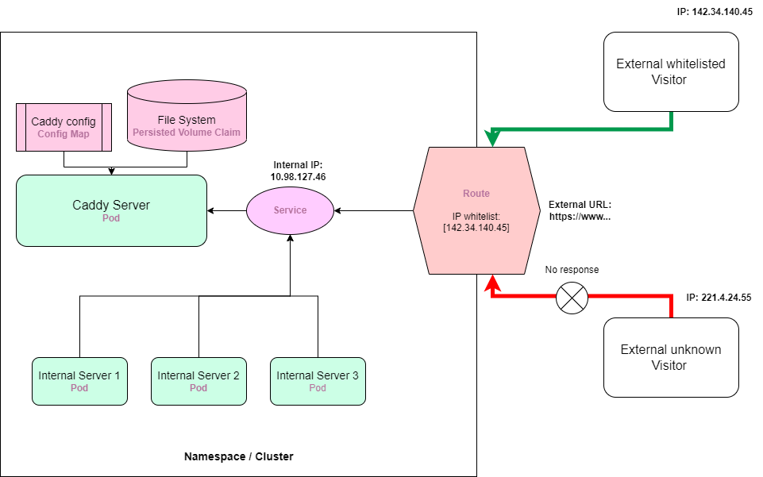

# oc-caddy


-- Open Shift Caddy data server template YAML files --

This is a collection of template YAML files to quickly build up a caddy data server in an Open Shift cluster. The data server is consisted of a Caddy pod, a service object, and a route object for restricted external access (if applicable). The objects are defined in YAML files and can be applied to a cluster on the run.


 
## Quick Start

* Change the MY-WOKSPACE namespace field in the YAML files to the namespace of your cluster


```yaml
...
metadata:
  namespace: MY-WOKSPACE
...
```

* Configure the volume size for the data server in [caddy-pvc.yaml](caddy-pvc.yaml). The default size is 1G.
```yaml
...
spec:
  accessModes:
    - ReadWriteMany
  resources:
    requests:
      storage: 1Gi
...
```
* Configure the CPU and memory size of the Caddy server pod in [caddy-deployment.yaml](caddy-deployment.yaml). Or you may use the default values.
```yaml
...
 containers:
        - resources:
            limits:
              cpu: 500m
              memory: 2Gi
            requests:
              cpu: 50m
              memory: 1Gi
...
```
* If allow external access, configure the allowed IP/IP blocks in [caddy-route.yaml](caddy-route.yaml). Multiple IP addresses are separated by spaces. The default IP block 0.0.0.0/0 enables all IPs.
```yaml
...
 metadata:
  name: caddy-route
  namespace: MY-WOKSPACE
  labels:
    app: caddy
  annotations:
    haproxy.router.openshift.io/ip_whitelist: 0.0.0.0 0.0.0.0/0
...
```

* Log in Open Shift in terminal. Then apply the YAML scripts in the following order. Skip caddy-route.yaml if you only need the data server to be used inside the cluster.

```bash
oc apply -f caddy-configmap.yaml
oc apply -f caddy-pvc.yaml
oc apply -f caddy-deployment.yaml
oc apply -f caddy-service.yaml

# for controlled external access
oc apply -f caddy-route.yaml

# don't forget to implement a public network policy if you don't have it in the cluster
oc apply -f default-network-policy.yaml
```


You should be access to the Caddy server internal at: **caddy-service.MY-NAMESPACE.svc.cluster.local** and public at: **http://caddy-route-MY-NAMESPACE.apps.silver.devops.gov.bc.ca** (if setup).

By default files are stored in the **/data** folder in the volume. You may modify the position in Caddy configure file in [caddy-configmap.yaml](caddy-configmap.yaml)


## Contributing

Pull requests are welcome. For major changes, please open an issue first
to discuss what you would like to change.

Please make sure to update tests as appropriate.

## License

[MIT](https://choosealicense.com/licenses/mit/)